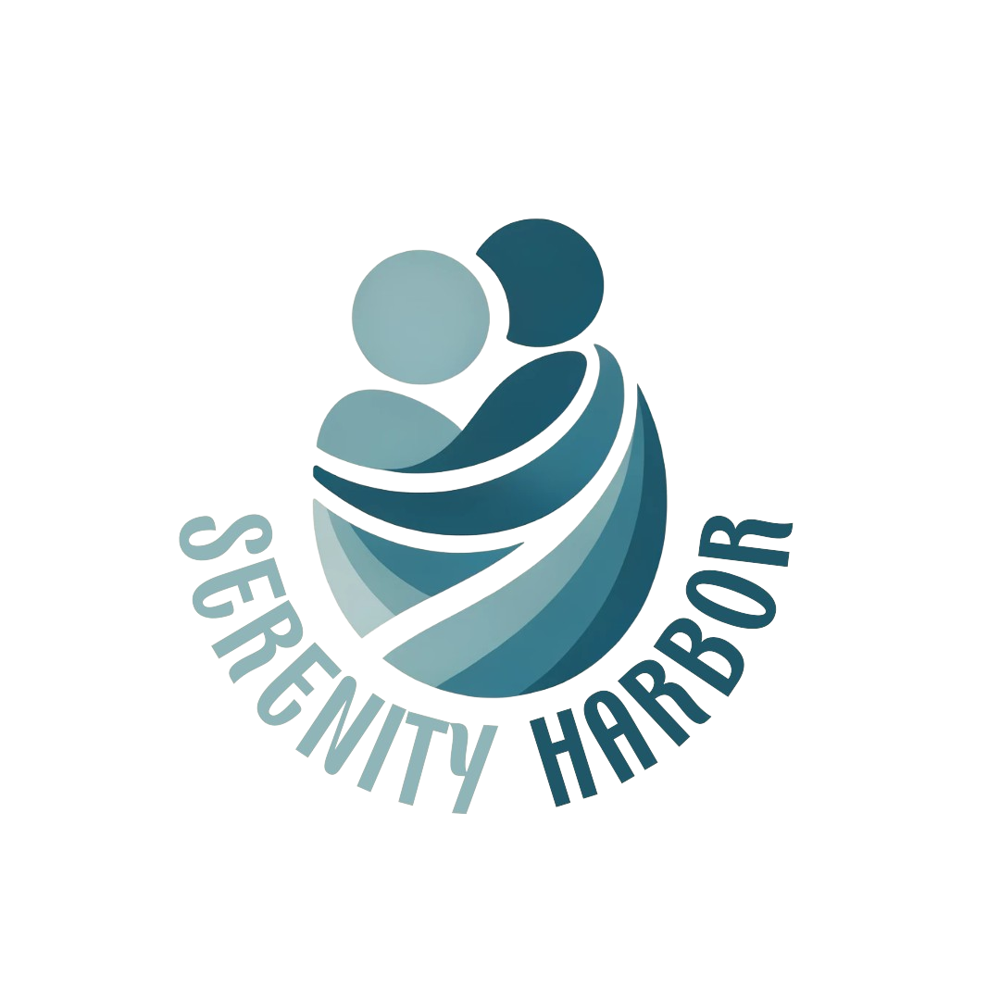
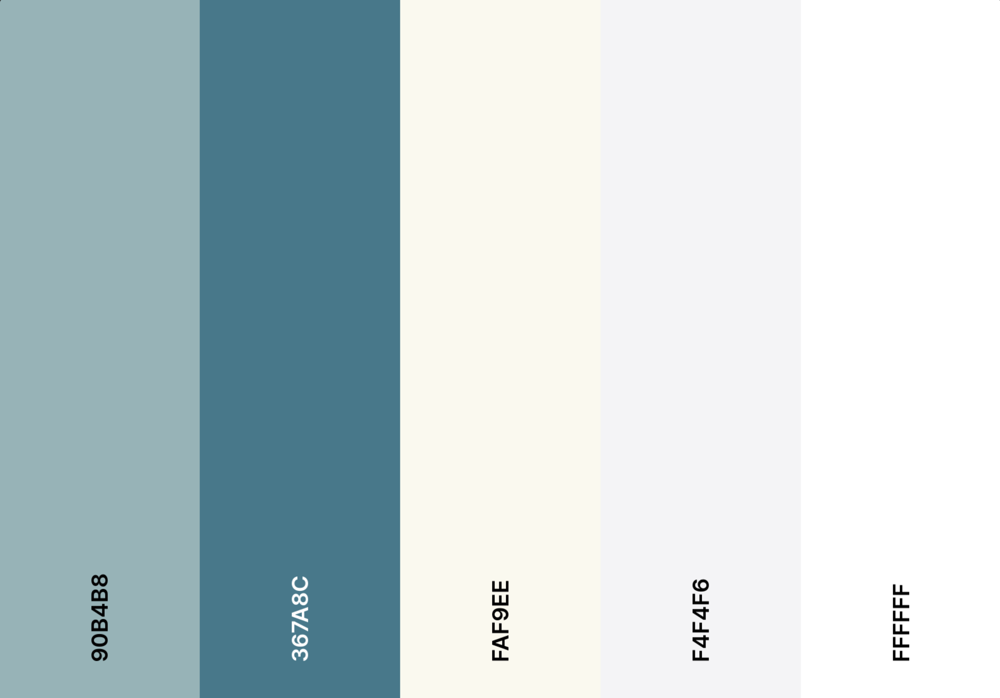

# Serenity Harbor



## Backend Setup:

Create a virtual environment:

```bash
python -m venv venv
```

Activate the virtual environment:

for windows
```bash
.\venv\Scripts\activate
```
for Linux
```bash
source venv/bin/activate
```

Install the required Python packages:

```bash
pip install -r requirements.txt
```

Create a `.env` file in the root directory with the following content or check Discord #resources for my .env

```
OPENAI_API_KEY = <your_api_key_here>
FT_MODEL = <finetuned_model_id>
MONGODB_URI = <mongodb_uri>
JWT_SECRET_KEY = <jwt_secret_key>
TOKENIZERS_PARALLELISM = false
```

## Frontend Setup:

Install Node.js dependencies:

```bash
npm install
```

Start the frontend development server:

```bash
npm start
```

Create a .env file in the frontend directory and add the following

```
REACT_APP_BACKEND_HOST=http://127.0.0.1:8080
```

Use /login /register and /chat if some of the pages are in development and you cannot access pages.


Color Palette


#90B4B8
#367A8C
#FAF9EE
#F4F4F6
#FFFFFF

